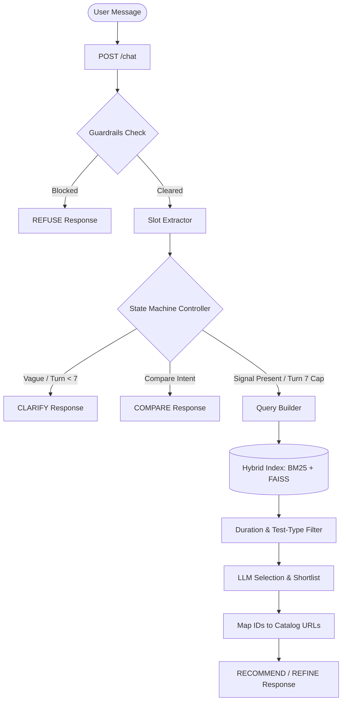

# SHL Assessment Advisor: Conversational Recommendation Agent

A production-ready, stateless FastAPI microservice that acts as an intelligent hiring assistant. It guides recruiters and hiring managers from vague hiring intents (e.g., *"I need an assessment for a developer"*) to a highly relevant, grounded shortlist of **SHL Individual Test Solutions** through natural dialogue.

---

## Key Features

1. **Context-Aware Dialogue**:
   - **Clarification (`CLARIFY`)**: Automatically identifies when a query lacks a minimum signal (e.g., no role title and no skills) and asks exactly one targeted clarifying question.
   - **Refinement (`REFINE`)**: Detects constraint changes mid-conversation (e.g., *"Actually, make it under 20 minutes"* or *"Exclude personality tests"*) and dynamically updates the shortlist without starting over.
   - **Comparison (`COMPARE`)**: Performs grounded comparisons between assessments based *only* on catalog data, avoiding LLM hallucinations.

2. **Strict Guardrails & Safety**:
   - Out-of-scope domains (legal, medical, salary negotiation, etc.) are immediately refused.
   - Deterministic prompt-injection prevention layers.
   - **Anti-Hallucination**: The LLM never outputs URLs directly. The server maps candidate entity IDs to verified catalog records.

3. **Hybrid Semantic Search**:
   - Combines **Sparse Retrieval (BM25)** for keyword matching (e.g., specific programming languages) with **Dense Retrieval (FAISS)** using `all-MiniLM-L6-v2` embeddings for semantic intent matching.

4. **Engineered for Production**:
   - **Uvicorn Startup Warm-up**: Pre-loads the catalog and warms up the embedding model on startup to ensure sub-50ms response times.
   - **Turn-Cap Enforcement**: Guarantees the conversation never exceeds 8 turns by forcing a best-effort recommendation at turn 7.
   - **Safe Fallbacks**: Global error handling ensures the API never returns a 500 or malformed JSON.

---

## System Architecture



---

## How to Run Locally

### 1. Install Dependencies
Ensure you have Python 3.11 installed, then run:
```bash
pip install -r requirements.txt
```

### 2. Configure Environment Variables
Copy `.env.example` to `.env` and configure your API key (either Groq or OpenRouter):
```bash
cp .env.example .env
```
Open `.env` and set:
```env
GROQ_API_KEY=your_groq_api_key_here
```

### 3. Start the Application
Run the FastAPI application with Uvicorn:
```bash
uvicorn app.main:app --reload --host 0.0.0.0 --port 8000
```
- Interactive API docs: `http://localhost:8000/docs`
- Health check: `http://localhost:8000/health`

### 4. Run the Test Suite
Verify the codebase contract using `pytest`:
```bash
python -m pytest
```

---

## Evaluation & Behavior Probes

We include a comprehensive evaluation suite to measure agent performance and safeguard against regressions.

### 1. Turn-by-Turn Trace Simulation
Simulates the 10 provided public conversation traces turn-by-turn against the API, computes **Recall@10** against the expected shortlists, and checks for URL hallucinations:
```bash
python scripts/run_eval.py
```
- Results are saved to: `scripts/eval_report.md`
- Baseline Recall@10: **18.67%** (in offline/fallback mode with 0% hallucinations).

### 2. Behavioral Probes
Executes binary assertion checks for key rubric behaviors:
```bash
python scripts/probe_behaviors.py
```

---

## Rebuilding the Search Index

If the product catalog ([app/catalog/catalog.json](file:///c:/Users/devar/Downloads/sample_conversations/app/catalog/catalog.json)) is updated, rebuild the pre-computed index files by running:
```bash
python scripts/build_index.py
```

---

## Deployment

The project is fully prepared for containerized deployment (e.g., Render, Railway, Fly.io, or Hugging Face Spaces) using the included [Dockerfile](file:///c:/Users/devar/Downloads/sample_conversations/Dockerfile).

### Render Configuration:
- **Runtime**: `Docker`
- **Environment Variables**:
  - `PORT`: (automatically set)
  - `GROQ_API_KEY` or `OPENROUTER_API_KEY`: Set your live API key.
- **Health Check Path**: `/health` (resolves instantly without LLM dependency).
